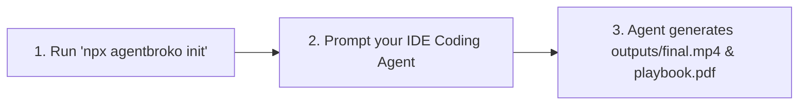

# AgentBroko ⚡
> **Local-First Skills Hub for Coding Agents & Creators**  
> *Video Forge • PDF Playbook • Offline Developer Tooling*

[](https://www.npmjs.com/package/agentbroko)
[](LICENSE)
[](pyproject.toml)
[](package.json)

AgentBroko transforms your IDE coding agent (**Google Antigravity**, **Cursor**, **VS Code Cline**, **Roo Code**, **Windsurf**, **Claude Code**) into a creative production engine. Install skills into your workspace, prompt your agent in plain English, and generate broadcast-grade 60 FPS MP4 videos and 20-page technical handbooks without cloud dependencies or external API fees.

---

## 🚀 The 3-Step Agent Workflow



### Step 1: Initialize Skills in Your Project
Run in your repository or workspace:
```bash
npx agentbroko init
```
This automatically installs:
- `.agents/skills/video-forge/SKILL.md` (Video Forge skill contract)
- `.agents/skills/pdf-playbook/SKILL.md` (PDF Playbook skill contract)
- `.agents/skills/pdf/SKILL.md` (Offline PDF tools)
- `.cursorrules` & `.agents/AGENTS.md` (IDE agent instructions)

---

### Step 2: Prompt Your AI Coding Agent

Open your AI editor and prompt your agent:

#### 🎬 For Video Generation:
> *"Create a 30-second vertical TikTok short for our SaaS launch. Use Video Forge to write the narration, synthesize speech, extract subtitles, and render the final MP4 video."*

#### 📄 For Developer Handbooks:
> *"Generate a 20-page developer playbook on 'Building AI Agents with Microservices' for Backend Engineers using the PDF Playbook skill."*

---

### Step 3: Instant Local Deliverables

Your AI agent reads the installed skill contracts, writes the structured `project.json` or `spec.json`, calls `agentbroko` locally, and delivers finished media assets directly in your project folder!

---

## 📦 Installation Options

### 1. Instant Execution with `npx`
```bash
# Initialize workspace skills
npx agentbroko init

# List available skills
npx agentbroko skills
```

### 2. Global NPM Install
```bash
npm install -g agentbroko
agentbroko init
```

### 3. Local Python Package Install
```bash
git clone https://github.com/sajidhossain8272/agentbroko.git
cd agentbroko
pip install -e .
```

---

## 🎬 Skill 1: Video Forge (Video Editing)

Video Forge is an automated video production skill:

```bash
# 1. Check local environment (FFmpeg, TTS engines)
agentbroko video-forge doctor

# 2. Initialize a new video project scaffold
agentbroko video-forge init my-video

# 3. Validate project schema
agentbroko video-forge validate my-video/project.json

# 4. Synthesize speech voiceover from script
agentbroko video-forge speak --file my-video/script.txt --output my-video/audio/narration.wav

# 5. Generate synchronized SRT subtitles
agentbroko video-forge captions --file my-video/script.txt --output my-video/captions/subtitles.srt

# 6. Render final broadcast MP4
agentbroko video-forge render my-video/project.json
```

---

## 📄 Skill 2: PDF Playbook (20-Page Handbook Synthesis)

PDF Playbook synthesizes publication-grade 20-page developer handbooks powered by ReportLab:

```bash
# Option A: Compile directly from your AI agent's JSON specification (Zero API keys needed!)
agentbroko pdf-playbook --spec playbook_spec.json --output playbook.pdf

# Option B: Automated generation with Google Gemini API
agentbroko pdf-playbook --api-key AIzaSy... --title "AI Agent Architecture" --output playbook.pdf

# Option C: 100% Offline AI generation with local Ollama
agentbroko pdf-playbook --provider ollama --title "Python Performance Guide" --output playbook.pdf
```

---

## 📑 Skill 3: Local Offline PDF Utilities

```bash
# Inspect PDF metadata & page count
agentbroko pdf info document.pdf

# Extract clean UTF-8 text to file (zero cloud upload)
agentbroko pdf text document.pdf --output extracted.txt

# Render PDF pages to high-resolution PNG images (requires Poppler)
agentbroko pdf render document.pdf --output rendered-pages/
```

---

## 🌟 Registered Skills Overview

| Skill | Command | Deliverable | Network Requirements |
| :--- | :--- | :--- | :--- |
| **Workspace Init** | `npx agentbroko init` | Provisions `.agents/skills/` & rules | Offline (0 KB) |
| **Video Forge** | `agentbroko video-forge` | 60 FPS MP4 video with TTS & captions | Offline (0 KB) |
| **PDF Playbook** | `agentbroko pdf-playbook` | 20-page formatted `.pdf` handbook | Offline / AI Agent / Ollama |
| **PDF Tools** | `agentbroko pdf` | Clean text extraction & page rendering | Offline (0 KB) |

---

## 📄 License

MIT Licensed • Open Source • Maintained by [Broke Innovation](https://github.com/sajidhossain8272/agentbroko).
