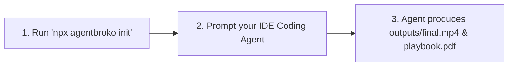

# AgentBroko ⚡
> **Local-First Skills Hub for Coding Agents & Creators**  
> *Video Forge • PDF Playbook • Offline Developer Tooling*

[](https://www.npmjs.com/package/agentbroko)
[](LICENSE)
[](pyproject.toml)
[](package.json)

AgentBroko transforms your IDE coding agent (**Google Antigravity**, **Cursor**, **VS Code Cline**, **Roo Code**, **Windsurf**, **Claude Code**, **GitHub Copilot**) into a creative production engine. Install skills into your workspace, prompt your agent in plain English, and generate broadcast-grade 60 FPS MP4 videos and 20-page technical handbooks without cloud dependencies or external API fees.

---

## 🚀 The 3-Step Agent Workflow



### Step 1: Initialize or Add Skills in Your Project

```bash
# Provision ALL skills into workspace (.agents/skills/, AGENTS.md, .cursorrules, CLAUDE.md)
npx agentbroko init

# Or install just ONE specific skill:
npx agentbroko add video-forge     # Add Video Forge only
npx agentbroko add video-edit       # Add optional desktop edit workflow
npx agentbroko add pdf-playbook   # Add PDF Playbook only
npx agentbroko add pdf            # Add Offline PDF Tools only

# Or clone the full starter repo:
npx agentbroko clone my-agent-workspace
```

This automatically creates:
- `.agents/skills/<skill>/SKILL.md` (Formal skill definition contract & CLI blueprints)
- `.agents/skills/<skill>/examples/` (Sample template configurations)
- `.agents/AGENTS.md` & `.cursorrules` & `CLAUDE.md` (Agent instructions + 🆘 emergency troubleshooting guide)

---

### Step 2: Prompt Your AI Coding Agent

Open your AI editor and prompt your agent:

#### 🎬 For Video Generation:
> *"Create a 30-second vertical TikTok short for our SaaS launch. Use Video Forge to write the narration, synthesize speech, extract subtitles, and render the final MP4 video."*

#### 🎞️ For Post-Production Editing:
> *"Use the optional video-edit workflow to trim and polish this existing reel. Keep the final cut in 9:16 and preserve the local-first workflow."*

#### 📄 For Developer Handbooks:
> *"Generate a 20-page developer playbook on 'Building AI Agents with Microservices' for Backend Engineers using the PDF Playbook skill."*

---

### Step 3: Instant Local Deliverables

Your AI agent reads the installed skill contracts, writes the structured `project.json` or `spec.json`, calls `agentbroko` locally, and delivers finished media assets directly in your project folder!

---

## 🛠️ CLI Commands & Utilities

```bash
# Show skills and commands
npx agentbroko skills

# System diagnostic check (FFmpeg, Python, ReportLab, TTS)
npx agentbroko doctor

# View AI agent instruction and recovery guide
npx agentbroko guide

# Direct skill commands
npx agentbroko video-forge doctor
npx agentbroko pdf-playbook --help
npx agentbroko pdf info document.pdf
```

---

## 🎬 Skill 1: Video Forge (10/10 Procedural & Cinematic Video Engine)

Video Forge is a procedural video engine designed to create broadcast-quality product ads, viral YouTube Shorts, Instagram Reels, and cinematic documentary stories with fluid motion, particle physics, atmospheric parallax, and neural voiceover synchronization:

```bash
# 1. Prompt-to-Video: Turn a brief into a finished video
agentbroko video-forge generate "60s ad for MyProduct, an autonomous developer OS" --name myproduct --seconds 30

# 2. Render 9:16 Vertical Storytelling Short / Reel (3D parallax, volumetric rays, kinetic typography)
agentbroko video-forge short --type story --theme golden -o outputs/short.mp4

# 3. Render a procedural spec.json ad
agentbroko video-forge render ads/demo/spec.json

# 4. Check local environment (FFmpeg, Pillow, NumPy, Neural TTS)
agentbroko video-forge doctor

# 5. Synthesize high-fidelity neural speech voiceover
agentbroko video-forge speak --text "Welcome to AgentBroko." --output audio/vo.wav --engine edge --voice en-US-ChristopherNeural

# 6. Initialize classic clip timeline or procedural project
agentbroko video-forge init my-video --template procedural
```

---

## 📄 Skill 2: PDF Playbook (20-Page Handbook Synthesis)

PDF Playbook synthesizes publication-grade 20-page developer handbooks powered by ReportLab:

```bash
# Option A: Compile directly from your AI agent's JSON specification (Zero API keys needed!)
agentbroko pdf-playbook --spec playbook_spec.json --output playbook.pdf

# Option B: Automated generation with Google Gemini API
agentbroko pdf-playbook --api-key AIzaSy... --title "AI Agent Architecture" --output playbook.pdf

# Option C: 100% Offline AI generation with local Ollama
agentbroko pdf-playbook --provider ollama --title "Python Performance Guide" --output playbook.pdf
```

---

## 📑 Skill 3: Local Offline PDF Utilities

```bash
# Inspect PDF metadata & page count
agentbroko pdf info document.pdf

# Extract clean UTF-8 text to file (zero cloud upload)
agentbroko pdf text document.pdf --output extracted.txt

# Render PDF pages to high-resolution PNG images (requires Poppler)
agentbroko pdf render document.pdf --output rendered-pages/
```

---

## 🆘 Agent Stuck / Self-Recovery Protocol

If an AI agent gets stuck or encounters an error during execution:
1. **Run Doctor**: Execute `npx agentbroko doctor` to identify missing runtime tools.
2. **FFmpeg missing**:
   - Windows: `winget install Gyan.FFmpeg`
   - macOS: `brew install ffmpeg`
   - Linux: `sudo apt install ffmpeg`
3. **ReportLab missing**:
   - `python -m pip install reportlab`
4. **Project Validation**:
   - Always run `npx agentbroko video-forge validate <path>/project.json` before rendering.
5. **Inspect Media**:
   - Use `ffprobe` to verify audio and video dimensions locally.

---

## 🌟 Registered Skills Overview

| Skill | Command | Deliverable | Network Requirements |
| :--- | :--- | :--- | :--- |
| **Workspace Init** | `npx agentbroko init` | Provisions all `.agents/skills/` & rules | Offline (0 KB) |
| **Add Single Skill** | `npx agentbroko add <skill>` | Provisions a specific skill | Offline (0 KB) |
| **Video Forge** | `agentbroko video-forge` | 60 FPS MP4 video with TTS & captions | Offline (0 KB) |
| **Video Edit** | `agentbroko add video-edit` | Optional polishing pass for existing footage or MCP-connected desktop editors | Optional |
| **PDF Playbook** | `agentbroko pdf-playbook` | 20-page formatted `.pdf` handbook | Offline / AI Agent / Ollama |
| **PDF Tools** | `agentbroko pdf` | Clean text extraction & page rendering | Offline (0 KB) |

---

## 📄 License

MIT Licensed • Open Source • Maintained by [Broke Innovation](https://github.com/sajidhossain8272/agentbroko).
